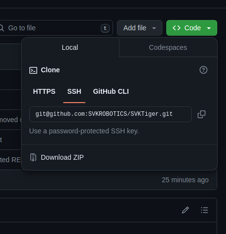
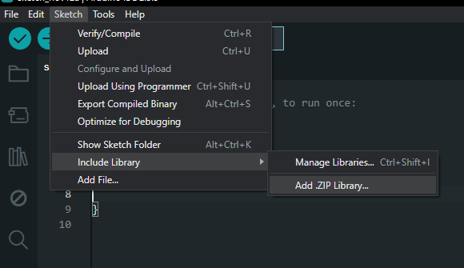

# SVKTiger Line Follow Robot


## About 

This is an Arduino library for the **SVKRobotics Tiger Line Follow Robot**, a complete robot kit developed by [SVKRobotics](https://svkrobotics.com). This kit is designed for beginners and advanced users alike, featuring a custom control board and a precise IR sensor array to accurately and quickly detect black line changes. For more information, visit [svkrobotics.com](https://svkrobotics.com).

## Features

- **Accurate Line Following**: Uses an advanced IR sensor array to precisely detect line changes.
- **Easy Integration**: Designed for seamless integration with the Arduino IDE.
- **Customizable Control**: Includes a range of customizable settings to fine-tune the robot’s responsiveness.
- **Expandable**: Built for flexibility, allowing users to add additional sensors and features.
  
## Getting Started

Follow these steps to set up and use this library with your Arduino IDE.

### Download and Installation

1. **Download the Library**:
   - Download this repository as a ZIP file by clicking the green "Code" button and selecting "Download ZIP".  
   

2. **Include the Library in Arduino IDE**:
   - Open the Arduino IDE, go to **Sketch** > **Include Library** > **Add .ZIP Library...**
   - Select the downloaded ZIP file to add the library.
   

3. **Select Your Board**: Make sure to select the correct board in the Arduino IDE that matches the SVKTiger Line Follow Robot's Nano board.

4. **Upload the Example Code**:
   - After installing the library, go to **File** > **Examples** and find **SVKTiger Line Follow Robot** examples. Start with the basic examples to ensure everything is working.

## Usage

Once the library is installed, you can begin programming your SVKTiger Line Follow Robot by including it in your sketch:

```cpp
#include <SVKTigerSensors.h>
#include <SVKTigerMotors.>

SVKTigerSensors sensors;
SVKTigerMotors motors(200, 50); // First param is maxSpeed, second is baseSpeed

// Continue code here based on what you need accordingly
```


## Main Functions

The library provides the following key functions for controlling the robot sensors and motors:

### For Sensors
- **`SVKTigerSensors sensors`**: Creates new sensor instance for user to use all sensor functions. For more info on all functions, see examples or read the header file [here](./src/SVKTigerSensors.h).
- **`setMultiplexerPins()`**: Initializes the robot’s multiplexer pins, that are used for reading the IR sensor array.
- **`calibrate()`**: Calibrates sensors to adjust to the color of the black line.
- **`readBlackLine()`**: Reads sensors and calculates exact position of line underneath the robot.

### For Motors
- **`SVKTigerMotors motors(uint8_t maxSpeed, uint8_t baseSpeed)`**: Creates new motor instance using custom constructors, and in this case we add a custom maxSpeed and baseSpeed. For more information on the SVKTigerMotors constructors, see examples or read the header file inside [src folder here](./src/SVKTigerMotors.h).
- **`setMaxSpeed(uint8_t maxSpeed)`**: Sets maximum speed that motors will reach.
- **`setBaseSpeed(uint8_t baseSpeed)`**: Sets base starting speed that robot will have.
- **`setMotorSpeeds(uint8_t leftSpeed, uint8_t rightSpeed)`**: Set motor speeds and starts them directly, no PID feedback direct motor control function.
- **`runMotors(int output, int error)`**: Starts robot motors using the output and error taken from a PID output, used for line following.
<br>

### Direct Register Access

This library also uses direct register access to speed up the performance and accuracy of the Arduino Nano and robot.
Using direct register access the robot writes digital and PWM signals directly into the registers, increasing the speed and accuracy of these signals.

This Direct Register Access is default ON in the source code, however is optional and can be turned off by the user, if you choose to use normal digital
and analogWrite commands.

These normal analogWrite commands are already in the source code, and if you wish to remove Direct Register Access (not advised),

Simply add this line in the start of your arduino .ino sketch:
```cpp
   #undef USE_PWM_REGISTERS
```

This command undefines the already existing micro **#define USE_PWM_REGISTERS**, and changes all affected functions to use normal digital and analogWrite functions.


## Troubleshooting

If you encounter any issues while using this library, check the following:

- **Power Supply**: Ensure the robot is properly powered.
- **Sensor Alignment**: Make sure the IR sensor array is correctly positioned over the line.
- **Firmware Version**: Verify that you have the latest version of the library installed.

For further assistance, you can contact us on [info@svkrobotics.com](mailto:info@svkrobotics.com?subject=Support) or create an issue in this GitHub repository.

## Contributing

We welcome contributions! To contribute:

1. Fork this repository.
2. Create a new branch (`git checkout -b feature-branch`).
3. Make changes and commit them (`git commit -am 'Add new feature'`).
4. Push to the branch (`git push origin feature-branch`).
5. Open a pull request.

## License

This library is licensed under the MIT License. See the [LICENSE](LICENSE) file for details.

